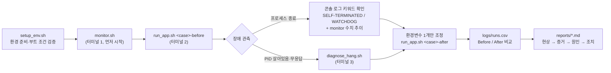

# agent-leak-app 시스템 장애 분석 (OOM / CPU Spike / Deadlock)

제공된 `agent-leak-app`을 리눅스에서 실행하면서 세 가지 장애(Memory Leak → OOM, CPU Spike, Deadlock)를 재현합니다. 관제 데이터와 로그로 원인을 추론하고, 결과를 GitHub Issue 형식의 리포트 3건으로 정리합니다.
모든 스크립트는 리눅스 표준 도구(`ps`, `top`, `pgrep`, `ss`, `df`, `/proc`, `awk`)만 사용합니다.

---

## 1. 디렉터리 구조

```
.
├── README.md
├── agent.env             # 이번 과제 경로 설정 (AGENT_HOME=~/agent-leak, APP_BIN, PROC_NAME)
├── scripts/
│   ├── setup_env.sh      # 환경변수·디렉터리·secret.key 준비 + 부트 조건 사전 검증 (source 용)
│   ├── lib.sh            # 공통 함수: PID 탐색, /proc/PID/environ 조회, 최신 로그/로그 정체 시간
│   ├── run_app.sh        # 앱 1회 실행 → 콘솔 로그 저장, 생존 시간·종료 코드·종료 사유를 runs.csv 에 기록
│   ├── monitor.sh        # 관제: 프로세스 CPU / 시스템 CPU / RSS / 스레드 수 / 상태 / 로그 정체 시간
│   └── diagnose_hang.sh  # "살아있지만 멈춘" 상태 진단: ps -ef → ps -L(T0/T1) → top -H → 마지막 로그 → 판정
├── docs/
│   ├── EVIDENCE.md       # 평가 항목 1 실행 증거 페이지 (캡처 + 항목별 설명)
│   └── evidence/         # 증거 캡처 이미지
├── reports/
│   ├── 01-oom.md         # [Bug] OOM 이슈 리포트 (템플릿 → 실측값으로 채움)
│   ├── 02-cpu.md         # [Bug] CPU Spike 이슈 리포트
│   └── 03-deadlock.md    # [Bug] Deadlock 이슈 리포트
└── logs/                 # 실행 산출물 (2026-09-27 제출용 실행 로그 포함)
    ├── monitor_*.log     #   monitor.sh 관제 로그
    ├── console_<tag>_*.log  # run_app.sh 가 저장한 앱 콘솔 출력 (줄마다 수신 시각 prefix)
    ├── diagnose_*.log    #   diagnose_hang.sh 진단 결과
    └── runs.csv          #   실행별 Before/After 비교표
```

### 스크립트 역할과 데이터 흐름

| 스크립트 | 입력 | 출력 | 핵심 명령 |
|---|---|---|---|
| `setup_env.sh` | (선택) 덮어쓸 환경변수 | export 된 환경변수, 디렉터리, `secret.key` | `id -u`, `ss -ltn`, 정규식 범위 검사 |
| `run_app.sh <tag>` | 환경변수, `RUN_TIMEOUT` | `console_<tag>_*.log`, `runs.csv` 한 줄 | 백그라운드 실행 + `wait`, `trap`, 종료 코드 해석(137/143) |
| `monitor.sh [주기]` | 실행 중인 PID | `monitor_*.log` | `pgrep`, `top -b -n 2 -d -p`, `ps -o rss,%mem,nlwp,stat`, `/proc/PID/environ`, `stat -c %Y` |
| `diagnose_hang.sh [초]` | 실행 중인 PID | `diagnose_*.log` + VERDICT | `ps -ef`, `ps -L -o ...wchan`, `top -H`, `/proc/PID/stat`, `tail`/`grep` |

`monitor.sh` 출력 한 줄 형식:
```
[2026-09-26 22:09:21] PID:451 PROCESS:agent-leak-app CPU:7.0% SYS_CPU:34.7% MEM:2.6% RSS:99MB/LIMIT:100MB THREADS:1 STAT:S+ LOG_IDLE:1s DISK:936G STATUS:MEM_WARN
```
- `CPU`는 해당 프로세스, `SYS_CPU`는 시스템 전체 CPU 사용률입니다. 둘을 나란히 두면 특정 프로세스 문제인지 구분할 수 있습니다.
- `LIMIT`는 모니터링하는 터미널의 값이 아니라 대상 프로세스에 실제로 적용된 `MEMORY_LIMIT`입니다(`/proc/PID/environ`에서 읽음).
- `STATUS`의 의미는 다음과 같습니다.
  - `MEM_WARN`: RSS가 LIMIT의 80% 이상
  - `CPU_WARN`: CPU가 CPU_MAX_OCCUPY의 80% 이상
  - `HANG_SUSPECT`: 로그가 주기×6초 이상 멈춰 있고 CPU가 1% 미만

---

## 2. 과제 파이프라인



1. **준비**: `setup_env.sh`로 부트 조건(비 root, 디렉터리, `secret.key`, 값 범위, 15034 포트)을 미리 검증합니다. 조건이 틀리면 앱을 띄우기 전에 원인을 출력합니다.
2. **관제 시작**: 앱보다 먼저 `monitor.sh`를 켭니다. 그래야 시작 시점의 기준값(baseline)부터 기록됩니다.
3. **Before 실행**: 조사할 변수 하나만 장애가 나는 값으로 두고, 나머지 두 변수는 장애가 나지 않는 값으로 고정합니다(변수 통제).
4. **관측·증거 수집**:
   - 프로세스가 종료되었다면 콘솔 로그의 종료 키워드와 monitor 수치 추이를 확인합니다.
   - 프로세스가 살아있는데 멈췄다면, 종료하기 전에 `diagnose_hang.sh`로 증거를 먼저 남깁니다.
5. **After 실행**: 해당 환경변수만 바꿔 재실행합니다. `RUN_TIMEOUT`을 주면 "N초 이상 생존"을 자동으로 판정합니다.
6. **비교·리포트**: `runs.csv`의 생존 시간, 종료 코드, 종료 사유로 Before/After 표를 만들고 `reports/`에 이슈를 작성합니다.

---

## 3. 실행 방법

### 3-1. 실행 환경 연결 (WSL Ubuntu-22.04, 최초 1회)

이전 과제의 `agent-app.service`(`/home/agent-admin/agent-app/agent_app.py`)가 부팅 때마다 15034 포트를 점유합니다. 그래서 이번 과제 앱이 바인딩에 실패합니다. 이번 과제는 이 서비스와 분리된 경로(`agent.env`)를 씁니다.

이전 과제의 `/etc/profile.d/agent-app.sh`가 로그인할 때마다 예전 경로를 export하지만, `agent.env`가 항상 이번 과제 값으로 덮어씁니다.

아래 명령은 모두 WSL Ubuntu-22.04 터미널에서 실행합니다. Windows Terminal이나 PowerShell에서 `wsl -d Ubuntu-22.04`로 들어가면 됩니다.

```bash
# 1) 이전 과제 서비스 중지 + 부팅 시 자동 시작 해제 (파일은 삭제하지 않음, 되돌리기: sudo systemctl enable --now agent-app.service)
sudo systemctl disable --now agent-app.service
ss -ltn | grep 15034 || echo "15034 free"

# 2) 제공받은 agent-app-leak.zip 에서 CPU 에 맞는 바이너리(x86_64 → agent-leak-app-x86, ARM → agent-leak-app-arm64)를
#    AGENT_HOME 에 agent-leak-app 이름으로 배치 (upload_files / api_keys / logs / secret.key 는 setup_env.sh 가 생성)
uname -m
install -m 755 /path/to/agent-leak-app-x86 ~/agent-leak/agent-leak-app

# 3) 프로젝트 폴더로 이동해 부트 조건 검증 → "[setup] OK" 가 나오면 준비 완료
cd "/mnt/c/Users/LG/OneDrive - 숭실대학교 - Soongsil University/바탕 화면/임베디드/agent-leak-troubleshooting"
source scripts/setup_env.sh
```

- 경로를 바꾸려면 `agent.env`를 수정합니다.
- 프로젝트가 `/mnt/c`(Windows 드라이브)에 있으므로 스크립트는 `bash scripts/xxx.sh` 형태로 실행하는 편이 안전합니다. 실행 권한 비트가 유지되지 않을 수 있기 때문입니다. 아래 예시의 `scripts/xxx.sh`도 필요하면 앞에 `bash`를 붙이세요.

### 3-2. 앱 동작 규칙 (실측)

제공 바이너리를 직접 실행해 확인한 동작입니다. 실험 조건은 이 규칙을 기준으로 정했습니다.

- **검사 순서**: 앱은 시작할 때 설정을 **메모리 → CPU → 스레드** 순서로 검사합니다. 가장 먼저 걸리는 장애 하나만 재현합니다. 그래서 한 케이스를 실험할 때는 나머지 두 변수를 안정값으로 둬야 합니다.

| 변수 | 장애 재현 값 | 동작 | 안정 값 | 동작 |
|---|---|---|---|---|
| `MEMORY_LIMIT` | `256` 이하 | `[MemoryWorker] Current Heap`이 약 3초마다 25MB씩 선형 증가. 한도를 넘으면 `[MemoryGuard]`가 SIGKILL(137)로 자기 종료 | `512` | 한도에 도달하면 `Starting cleanup...` → `MEMORY RECOVERED`로 캐시를 비우고 계속 실행 |
| `CPU_MAX_OCCUPY` | `51` 이상 (예: `100`) | `[CpuWorker] Current Load`가 5%부터 오르다 50%를 넘으면 `CPU Threshold Violated!` → `WATCHDOG ... (SIGTERM)`, 종료 코드 143 | `50` 이하 | 한도에 도달하면 `Peak reached → cooldown`을 반복하며 생존 |
| `MULTI_THREAD_ENABLE` | `true` | Worker-Thread-1/2가 서로 상대의 락을 기다리며 `WAITING ... (Status: BLOCKED)` 상태로 정지 | `false` | 모두 안정값이면 `ALL CONFIGURATIONS OPTIMAL` 이후 정상 동작 |

- **CPU 부하 수치**: `[CpuWorker] Current Load`는 앱이 스스로 계산한 부하 값입니다. 실측해 보니 같은 시점에 `top`의 %CPU는 0~3%로 훨씬 낮았습니다. 그래서 CPU 증거는 두 가지를 함께 제시하고, 수치가 다르다는 점을 리포트에 적습니다.
  - 앱 로그의 Load 추이
  - `top`/monitor 스냅샷(해당 PID 대 시스템 전체)
- **증가 속도**: 메모리가 3초에 25MB씩 늘어서, `MEMORY_LIMIT=256`이면 30~50초 안에 종료됩니다.

### 3-3. 케이스별 실험

| 케이스 | Before (장애) | After (조치) | 고정값 (다른 장애 배제) | 실측 결과 |
|---|---|---|---|---|
| OOM | `MEMORY_LIMIT=256` | `MEMORY_LIMIT=512` | `CPU_MAX_OCCUPY=50 MULTI_THREAD_ENABLE=false` | Before: 약 30~50초 후 SIGKILL / After: 캐시를 비우고 생존 |
| CPU | `CPU_MAX_OCCUPY=100` | `CPU_MAX_OCCUPY=50` | `MEMORY_LIMIT=512 MULTI_THREAD_ENABLE=false` | Before: 약 25초 후 SIGTERM / After: cooldown을 반복하며 생존 |
| Deadlock | `MULTI_THREAD_ENABLE=true` | `MULTI_THREAD_ENABLE=false` | `MEMORY_LIMIT=512 CPU_MAX_OCCUPY=50` | Before: 약 7초 후 BLOCKED로 정지 / After: 정상 동작 |

```bash
# 터미널 1: 관제 (2초 주기) — 모든 실험 동안 켜 둔다
bash scripts/monitor.sh 2

# 터미널 2: OOM Before / After
MEMORY_LIMIT=256 CPU_MAX_OCCUPY=50 MULTI_THREAD_ENABLE=false bash scripts/run_app.sh oom-before
MEMORY_LIMIT=512 CPU_MAX_OCCUPY=50 MULTI_THREAD_ENABLE=false RUN_TIMEOUT=300 bash scripts/run_app.sh oom-after

# 터미널 2: CPU Before / After
CPU_MAX_OCCUPY=100 MEMORY_LIMIT=512 MULTI_THREAD_ENABLE=false bash scripts/run_app.sh cpu-before
CPU_MAX_OCCUPY=50  MEMORY_LIMIT=512 MULTI_THREAD_ENABLE=false RUN_TIMEOUT=300 bash scripts/run_app.sh cpu-after

# 터미널 2: Deadlock Before → BLOCKED 로그가 나오고 멈추면, 터미널 3에서 진단한 뒤 터미널 2에서 Ctrl+C
MULTI_THREAD_ENABLE=true MEMORY_LIMIT=512 CPU_MAX_OCCUPY=50 bash scripts/run_app.sh deadlock-before
bash scripts/diagnose_hang.sh 10          # 터미널 3
MULTI_THREAD_ENABLE=false MEMORY_LIMIT=512 CPU_MAX_OCCUPY=50 RUN_TIMEOUT=300 bash scripts/run_app.sh deadlock-after

# 결과 비교
cut -d, -f1,4-10 logs/runs.csv | column -s, -t
```

`runs.csv`의 `result` 값은 다음 뜻입니다.
- `EXITED`: 앱이 스스로 종료함
- `SURVIVED`: `RUN_TIMEOUT`까지 생존함
- `STOPPED_BY_USER`: Ctrl+C로 종료함

`exit_code`는 `137(SIGKILL)`, `143(SIGTERM)`처럼 어떤 시그널로 끝났는지 함께 보여줍니다.

**PID**: 제공 바이너리는 PyInstaller 형식이라 프로세스가 2개 뜹니다(부트로더 부모 + 실제 작업 자식). 다음 세 곳에 기록되는 PID는 모두 **실제 작업 자식 PID**로 같습니다.
- `runs.csv`의 `pid`
- `monitor.sh`의 `PID:`
- 앱 로그의 `Self-terminating process <PID>`

**로그 위치**:
- 콘솔 출력(부트 시퀀스, 경고/종료 배너 포함): `logs/console_<tag>_*.log`
- 앱 자체 로그: `~/agent-leak/logs/agent_app.log`

**pty 사용 이유**: `run_app.sh`는 `script`로 가상 터미널(pty)을 붙여 앱을 실행합니다. 파이프로 받으면 강제 종료 직전의 배너(`SELF-TERMINATED`, `WATCHDOG`)가 버퍼에 갇혀 유실되기 때문입니다.

---

## 4. 평가 항목별 설명 (항목 2 ~ 4)

### 항목 2 — 도구 사용과 진단 흐름

**Q. monitor.sh에서 메모리 증가 패턴을 추적하기 위해 사용한 명령어와 데이터 추출 방법은?**

- **PID 찾기**: `pgrep -n -x agent-leak-app`로 대상 PID를 찾습니다. `-n`을 쓰는 이유는 PyInstaller 바이너리가 부모(부트로더)와 자식(실제 작업) 2개로 뜨기 때문에, 가장 최근에 뜬 자식을 골라야 하기 때문입니다.
- **메모리 수집**: 주기마다 `ps -o rss=,%mem=,nlwp=,stat= -p <PID>`로 값을 읽고, RSS(KB)를 MB로 바꿔 타임스탬프와 함께 `logs/monitor_*.log`에 한 줄씩 누적합니다.
- **VSZ가 아니라 RSS를 쓰는 이유**: VSZ는 예약만 된 가상 주소 공간까지 포함합니다. RSS는 실제로 점유 중인 물리 메모리이고, MemoryGuard가 비교하는 기준도 이 값입니다.
- **임계치 비교**: `/proc/<PID>/environ`에서 그 프로세스에 실제로 적용된 `MEMORY_LIMIT`을 읽어 `RSS:xxMB/LIMIT:xxMB`로 함께 기록합니다. 그래서 한 줄만 봐도 임계치까지 남은 여유를 알 수 있습니다.
- **증가율 계산**: 기록된 로그에서 `grep PID:<PID> logs/monitor_*.log | awk -F'RSS:|MB/' '{print substr($0, 2, 19), $2}'`로 (시각, RSS) 열을 뽑습니다. 첫 값과 마지막 값의 차이를 경과 시간으로 나누면 증가율(MB/분)이 나옵니다. 증가폭이 매 구간 비슷하면 "선형 증가"로 판단하고, 증가율로 LIMIT 도달 시각을 역산해 실제 종료 시각과 맞는지 검증합니다.

**Q. 프로세스의 CPU 사용률을 확인하기 위해 선택한 도구와 옵션의 의미는?**

CPU는 `ps`가 아니라 `top -b -n 2 -d <주기> -p <PID>`로 측정했습니다. `ps`의 `%cpu`는 "시작 이후 누적 CPU 시간 ÷ 경과 시간"인 평균값이라 순간적인 스파이크가 희석됩니다.

| 옵션 | 의미 |
|---|---|
| `-b` | 배치 모드. 화면 제어 없이 텍스트로 출력하므로 파이프·awk로 파싱할 수 있음 |
| `-p <PID>` | 대상 프로세스만 출력 |
| `-d <주기>` | 두 샘플 사이의 측정 간격 |
| `-n 2` | 2번 샘플링. 1회차는 기준점이 없어 신뢰할 수 없으므로 버리고, 2회차(주기 동안의 실제 사용률)만 사용 |

같은 출력의 헤더 `%Cpu(s) ... id`에서 idle 값을 뽑아 `SYS_CPU = 100 - idle`로 시스템 전체 사용률도 함께 기록합니다. 이렇게 하면 "시스템 전체 부하"인지 "특정 프로세스 과점유"인지 구분할 수 있습니다. 스레드 단위로 볼 때는 `top -H`(스레드를 개별 행으로 표시)를 씁니다.

**Q. "살아있지만 멈춰있는 상태"를 진단하기 위해 어떤 도구를 어떤 순서로 사용했는가?**

`diagnose_hang.sh`는 아래 순서대로 가설을 하나씩 소거합니다.

1. **생존 확인** — `pgrep`/`ps -ef`: PID가 없으면 Hang이 아니라 Crash이므로 로그 분석으로 넘어갑니다.
2. **T0 스냅샷** — `ps -L -o pid,lwp,stat,pcpu,rss,wchan,time`: 스레드별 상태를 확인합니다. 모든 스레드가 `S`(interruptible sleep)이고 `R`(실행)이나 `D`(I/O 대기)가 아니면, CPU나 디스크 문제가 아니라 무언가를 기다리는 중입니다.
3. **T1 스냅샷** — N초 뒤 `/proc/PID/stat`의 utime+stime(CPU tick)과 RSS를 다시 읽고, `top -H`로 스레드별 %CPU를 봅니다. 변화량이 0이면 "일을 하지 않는다"는 것이 수치로 확정됩니다.
4. **로그 확인** — 최신 로그 파일의 수정 시각(`stat -c %Y`)으로 기록이 멈춘 시간을 구하고, `tail`과 `grep -i 'wait|block|lock'`로 마지막 기록을 확인합니다.
5. **판정**:
   - PID 있음 + CPU Δ=0 + RSS Δ=0 + 로그 정지 + `wchan=futex_wait` → 락을 기다리며 잠든 Deadlock
   - CPU는 쓰는데 로그만 멈춤 → 무한루프/라이브락

---

### 항목 3 — OS 동작 원리

**Q. 메모리 누수 시 애플리케이션의 메모리 보호 정책이 프로세스를 강제 종료하는 이유는?**

누수는 힙에 할당한 객체가 여전히 참조되고 있어서 GC도 회수하지 못하는 상태입니다. 그래서 RSS는 줄지 않고 계속 늘어납니다. 이대로 두면 물리 메모리가 고갈되고, 스왑으로 밀려나며 디스크 I/O가 폭증해(thrashing) 호스트 전체가 느려집니다. 결국 커널 OOM Killer가 `oom_score` 기준으로 희생 프로세스를 고르는데, 이때 DB나 sshd 같은 무관한 프로세스가 죽을 수도 있습니다.

MemoryGuard는 이 상황이 오기 전에 정해둔 한도(`MEMORY_LIMIT`)에서 누수 당사자만 스스로 종료합니다(fail-fast). 그 결과 다음 효과를 얻습니다.
- 피해 범위를 해당 프로세스 하나로 제한
- "Memory limit exceeded" 같은 명확한 로그를 남김
- 재시작 가능한 깨끗한 상태로 복귀

**Q. CPU 과점유 시 단일 프로세스를 종료하는 것이 시스템 보호에 왜 필요한가?**

CPU는 스케줄러(CFS)가 실행 대기 중인 프로세스들에게 시간을 나눠주는 공유 자원입니다. 한 프로세스가 계속 실행 가능 상태(busy loop 등)로 코어를 점유하면 실행 대기열(run queue)이 길어집니다. 그러면 다른 서비스의 요청 처리, 헬스체크, sshd 같은 관리 접속까지 차례를 오래 기다리게 되어 시스템 전체의 응답 지연(latency)으로 번집니다.

원인 프로세스가 하나로 특정된 상황에서는, 그것을 SIGTERM으로 정리하는 편이 전체를 재부팅하는 것보다 훨씬 작은 비용으로 나머지 서비스를 지킵니다. SIGTERM은 SIGKILL과 달리 정리 작업을 할 기회를 줍니다. Watchdog 종료가 오류가 아니라 의도된 보호 조치로 보이는 이유도 여기에 있습니다.

**Q. 교착 상태가 발생하는 원리를 "상호 배제"와 "순환 대기"로 설명하면?**

- **상호 배제**: 락은 한 번에 한 스레드만 가질 수 있습니다. 이미 누가 쥐고 있으면 다른 스레드는 반드시 기다려야 합니다.
- **순환 대기**: 실제 로그에서 Worker-Thread-1은 `Shared_Memory_A`를 쥔 채 `Socket_Pool_B`를 기다리고, Worker-Thread-2는 `Socket_Pool_B`를 쥔 채 `Shared_Memory_A`를 기다립니다. 대기 관계가 1→2→1로 원을 이룹니다.

여기에 두 조건이 더 겹칩니다. 하나는 쥔 락을 놓지 않고 다음 락을 요청하는 **점유 대기**, 다른 하나는 남의 락을 빼앗을 수 없는 **비선점**입니다. 네 조건이 동시에 성립하면 어느 스레드도 진행할 수 없습니다. 스레드들은 커널 futex에서 잠든 상태이므로 CPU는 0%, 메모리와 로그도 변하지 않는 무응답 상태가 됩니다.

**Q. 로그에서 스레드 간 순환 의존 관계(A→B, B→A)를 어떻게 파악했는가?**

1. **스레드별 마지막 상태 추출**: 락 관련 로그만 골라 스레드별로 마지막 줄을 뽑습니다.
   ```bash
   grep -Ei 'acquir|lock|wait|block' <log> | awk 'match($0, /Thread-[A-Za-z0-9]+/) { last[substr($0, RSTART, RLENGTH)] = $0 } END { for (t in last) print last[t] }'
   ```
2. **표로 정리**: 결과를 "스레드 | 이미 획득한 락 | 기다리는 락" 표로 만듭니다.
3. **그래프로 변환**: "X가 가진 락을 Y가 기다린다"를 Y→X 간선으로 그리면 A→B, B→A의 사이클이 드러납니다.
4. **반증 확인**: 그 이후 `released`나 다음 단계 로그가 전혀 없고, `diagnose_hang.sh`에서 두 스레드 모두 `STAT=S`, `WCHAN=futex_wait`, CPU tick 변화 0으로 나오면, 락을 기다리며 영원히 잠들어 있다는 추론이 OS 관측으로도 뒷받침됩니다.

---

### 항목 4 — 개선과 회고

**Q. agent-leak-app이 실제 운영 서버에 있었다면, 장애 전에 누수를 탐지하도록 monitor.sh를 어떻게 개선하겠는가?**

지금은 "현재 값이 LIMIT의 80%"라는 정적 임계치만 봅니다. 운영용으로는 **추세 기반 예측**으로 바꾸겠습니다.

- **예측 경보**: 최근 N개 샘플의 RSS 기울기(MB/분)를 계산해 `(LIMIT − 현재 RSS) ÷ 기울기`로 도달 예상 시간을 구합니다. 이 값이 예를 들어 30분 미만이면 경보합니다. 이렇게 하면 아직 사용량이 낮아도 "꾸준히 늘기만 하는" 누수를 조기에 잡을 수 있습니다.
- **알림**: `curl`로 Slack/웹훅에 보내고, 같은 경보는 중복 억제합니다.
- **상시 실행**: `nohup` 대신 systemd service/timer로 띄워 재부팅 후에도 자동 실행되게 하고, `logrotate`로 로그를 순환합니다.
- **보존**: 경보가 뜬 순간 `/proc/PID/smaps_rollup`과 스레드 목록을 자동 저장해, 재시작 전에 증거가 남도록 합니다.
- **확장**: 이 지표들을 Prometheus(process-exporter)로 내보내 대시보드에서 장기 추세를 봅니다.

**Q. 3가지 장애 중 실제 서비스에서 가장 치명적인 것은? 이유와 근본 예방책은?**

**Deadlock**이 가장 치명적이라고 봅니다.

- **이유**: OOM과 CPU Spike는 프로세스가 죽으면서 로그를 남기므로 알아채기 쉽고, 프로세스 관리자(systemd/k8s)가 자동으로 재시작해 줍니다. 반면 Deadlock은 PID도 포트도 살아있어서 "프로세스 존재" 수준의 헬스체크를 통과합니다. 에러 로그도 없고 CPU·메모리 경보도 울리지 않습니다. 그래서 요청이 조용히 쌓이며 타임아웃되는 상태가 누군가 알아챌 때까지 계속됩니다(silent failure). 재현도 타이밍에 좌우되어 어렵습니다.
- **예방책**:
  - 모든 코드가 락을 **전역적으로 정해진 동일한 순서**로 획득하게 해 순환 대기 조건을 제거합니다.
  - `lock.acquire(timeout=...)`로 무한 대기를 없애고, 실패하면 로그를 남긴 뒤 재시도합니다.
  - 락 범위를 최소화하고, 가능하면 공유 상태 대신 큐 기반 메시지 전달로 설계합니다.
  - 운영 측면에서는 PID 확인이 아니라 "마지막 작업 처리 시각(heartbeat)"을 보는 liveness probe를 두어, 멈춘 프로세스를 자동으로 감지하고 재시작합니다.

**Q. 같은 서버에서 OOM과 Deadlock이 동시에 발생했다면 어떤 순서로 트러블슈팅하겠는가?**

순서는 **① 증거 스냅샷(수십 초) → ② OOM 대응 → ③ Deadlock 분석**입니다.

1. **증거 스냅샷**: 재시작하면 증거가 사라지므로, 먼저 두 프로세스의 `ps -L`, `top -H`, 마지막 로그, `diagnose_hang.sh` 결과를 빠르게 저장합니다.
2. **OOM 대응**: 판단 근거는 **피해 범위와 시간 민감도**입니다. 메모리 누수는 시간이 갈수록 악화되고, 호스트 메모리가 고갈되면 커널 OOM Killer나 thrashing으로 같은 서버의 다른 서비스, 관제 도구, SSH 접속까지 영향을 받습니다. Deadlock은 해당 프로세스 안에 갇힌 상태라 더 나빠지지 않습니다. 멈춘 스레드는 자원을 더 쓰지 않습니다. 따라서 OOM 쪽 프로세스를 먼저 재시작하거나 LIMIT을 조정해 서버 전체를 안정시킵니다.
3. **Deadlock 분석**: 그다음 여유를 갖고 교착 상태를 분석합니다. 단, 한 프로세스에서 두 증상이 같이 보이면 원인이 연결되어 있을 수 있습니다. 예를 들어 데드락 때문에 캐시를 정리하는 스레드가 멈춰 메모리가 쌓이는 경우입니다. 이때는 Deadlock이 근본 원인이므로 먼저 봅니다.

**Q. 소스 코드를 수정할 수 있다면, 장애 유형별로 어떤 코드 레벨 개선을 하겠는가?**

| 장애 | 코드 레벨 개선 |
|---|---|
| OOM | `tracemalloc` 스냅샷 비교로 누적되는 할당 지점을 찾습니다. 무한히 커지는 리스트/딕셔너리 캐시는 `collections.deque(maxlen=N)`나 `functools.lru_cache(maxsize=N)`처럼 상한을 둡니다. 처리가 끝난 데이터는 참조를 끊고, 큰 데이터는 전부 메모리에 올리지 않고 스트리밍/청크로 처리합니다. |
| CPU | `while True:` busy-wait를 `Event.wait()`/`Condition`이나 `sleep` + 지수 백오프로 바꿉니다. 무거운 연산은 작업 단위로 나눠 중간에 양보하고, 비효율적인 알고리즘(중첩 루프 등)은 개선하며, 요청 처리량에 rate limit을 둡니다. |
| Deadlock | 락 획득 순서를 전역적으로 고정하고, 항상 `with lock:` 컨텍스트 매니저로 해제를 보장합니다. `acquire(timeout=...)`로 대기 상한을 두고, 여러 락이 필요한 구간은 락 하나로 합치거나 `queue.Queue` 기반 생산자-소비자 구조로 바꿔 공유 락 자체를 줄입니다. |

**Q. 이 미션을 처음부터 다시 한다면 어떤 점을 다르게 접근하겠는가?**

- **관제 먼저, 기준값 확보**: 앱을 띄우기 전에 monitor.sh부터 켜 정상 상태의 기준값을 확보하겠습니다. 종료 직전 데이터만 있으면 "증가했다"는 사실을 비교로 증명할 수 없기 때문입니다.
- **변수 통제**: 한 번에 환경변수 하나만 바꾸고, 나머지 두 장애 요인은 꺼 둔 상태로 실험하겠습니다. 세 장애가 섞이면 종료 원인을 오인하기 쉽기 때문입니다.
- **기록 자동화**: 생존 시간과 종료 코드를 손으로 적지 않고 `run_app.sh`와 `runs.csv`로 자동 기록해, 같은 조건을 2회 이상 반복해 재현성을 확인하겠습니다.
- **증거 보존 우선**: 멈춘 프로세스를 발견하면 바로 kill하지 않고 `diagnose_hang.sh`로 증거를 먼저 남기는 "증거 보존 → 조치" 순서를 처음부터 습관화하겠습니다.

---

## 5. 평가 항목 1 증거 (실행 명령 + 캡처 위치)

> **실제 실행 결과(캡처 + 항목별 설명)는 [docs/EVIDENCE.md](docs/EVIDENCE.md)에 정리했습니다.** 이 장은 그 증거를 다시 만드는 방법을 설명합니다.

**준비**: 3-3의 실험을 위에서부터 순서대로 한 번 진행하면 8개 증거가 모두 나옵니다(총 20분 안팎). 각 항목은 두 부분으로 되어 있습니다.
- **실행**: 증거를 만드는 명령
- **캡처**: 스크린샷에 반드시 보여야 할 부분

캡처는 `docs/evidence/`에 항목 번호로 저장하고, 아래 `![...]` 자리에 연결합니다.

> **팁**: Windows Terminal에서 `Alt+Shift+D`로 창을 나눠 monitor와 앱 출력을 한 화면에 두고 `Win+Shift+S`로 캡처하면, 한 장에 PID·타임스탬프·로그를 함께 담을 수 있습니다. 텍스트 발췌도 같이 붙여 두면 채점자가 읽기 쉽습니다.

### 1-1. [OOM] 메모리 선형 증가 → 강제 종료 패턴

**실행**:
```bash
bash scripts/monitor.sh 2                                                                               # 터미널 1
MEMORY_LIMIT=256 CPU_MAX_OCCUPY=50 MULTI_THREAD_ENABLE=false bash scripts/run_app.sh oom-before           # 터미널 2
```

**캡처** (종료된 뒤 아래 명령 출력을 캡처):
```bash
grep -E "PID:|EXITED" logs/monitor_*.log | tail -n 18                                             # ① 관제 수치
grep -nE "MemoryWorker|MemoryGuard|SELF-TERMINATED" logs/console_oom-before_*.log | tail -n 10    # ② 실행 로그
```
- ① `RSS:42MB → 67 → 92 → … → 267MB/LIMIT:256MB`로 **일정하게 증가**하는 줄들
  - `STATUS:MEM_WARN`으로 바뀌는 지점
  - 마지막 `PROCESS:agent-leak-app EXITED (PID:xxxx)`
- ② `[MemoryWorker] Current Heap: 25MB → 50MB → …`가 3초 간격으로 증가하는 줄들
  - `[CRITICAL] [MemoryGuard] Memory limit exceeded (275MB >= 256MB)`
  - `Self-terminating process <PID>`
  - `>>> [SYSTEM] SELF-TERMINATED (Memory Limit Exceeded) <<<`


### 1-2. [OOM] MEMORY_LIMIT 조정 Before & After

**실행**:
```bash
MEMORY_LIMIT=512 CPU_MAX_OCCUPY=50 MULTI_THREAD_ENABLE=false RUN_TIMEOUT=300 bash scripts/run_app.sh oom-after
```

**캡처**:
```bash
grep -E "^tag|^oom" logs/runs.csv | cut -d, -f1,4-9 | column -s, -t                              # ① 비교표
grep -nE "Reached Limit|Flushed|RECOVERED" logs/console_oom-after_*.log                          # ② After 로그
```
- ① `oom-before`: `survival_sec` 약 30~50초, `137(SIGKILL)`, `EXITED`, `SELF-TERMINATED`
  - `oom-after`: `300`, `SURVIVED`
  - 두 줄을 한 화면에 담습니다.
- ② After에서는 한도에 도달해도 `Memory Usage Reached Limit (525MB). Starting cleanup...` → `MEMORY RECOVERED (Cache Cleared)`로 **종료 대신 회복**하는 줄


### 1-3. [CPU] CPU 사용률 임계치 초과 → 종료 패턴

**실행**:
```bash
CPU_MAX_OCCUPY=100 MEMORY_LIMIT=512 MULTI_THREAD_ENABLE=false bash scripts/run_app.sh cpu-before             # 터미널 2
top -b -n 1 -p "$(pgrep -n -x agent-leak-app)" | head -n 8                                                # 터미널 3, 실행 중(약 15초 시점)
```

**캡처**:
```bash
grep -nE "CpuWorker|WATCHDOG" logs/console_cpu-before_*.log | tail -n 12                         # ① 실행 로그
grep -E "PID:|EXITED" logs/monitor_*.log | tail -n 12                                             # ② 관제
```
- ① `[CpuWorker] Current Load: 5.00% → 12% → … → 50.87%`로 오르는 줄들
  - `[CRITICAL] [CpuWorker] CPU Threshold Violated!`
  - `>>> [SYSTEM] WATCHDOG: INITIATING EMERGENCY ABORT (SIGTERM) <<<`
- ② / top: 해당 **PID의 %CPU**와 `SYS_CPU`(시스템 전체)를 나란히 보여, 특정 프로세스의 문제임을 표시합니다.
  - 3-2에서 설명했듯 앱이 보고하는 Load와 top 수치는 다르므로, 그 점도 캡션에 적습니다.


### 1-4. [CPU] CPU_MAX_OCCUPY 조정 Before & After

**실행**:
```bash
CPU_MAX_OCCUPY=50 MEMORY_LIMIT=512 MULTI_THREAD_ENABLE=false RUN_TIMEOUT=300 bash scripts/run_app.sh cpu-after
```

**캡처**:
```bash
grep -E "^tag|^cpu" logs/runs.csv | cut -d, -f1,4-9 | column -s, -t                              # ① 비교표
grep -nE "Peak reached|Cooldown complete" logs/console_cpu-after_*.log | head -n 6               # ② After 로그
```
- ① `cpu-before`: 약 25초, `143(SIGTERM)`, `WATCHDOG`
  - `cpu-after`: `300`, `SURVIVED`
- ② `Peak reached (50.00%). Starting cooldown...` ↔ `Cooldown complete (5.00%)`가 반복되며, **한도에서 스스로 멈추는** 줄


### 1-5. [Deadlock] PID는 살아있으나 CPU/메모리/로그가 멈춘 상태 식별

**실행**:
```bash
MULTI_THREAD_ENABLE=true MEMORY_LIMIT=512 CPU_MAX_OCCUPY=50 bash scripts/run_app.sh deadlock-before           # 터미널 2
# BLOCKED 로그가 나오고 30초 이상 멈춘 뒤, 터미널 2를 끄지 말고 터미널 3에서:
ps -ef | grep [a]gent-leak-app
bash scripts/diagnose_hang.sh 10
```

**캡처**:
- `ps -ef` 출력: 부모/자식 **PID 2개가 살아있는** 줄
- `diagnose_hang.sh` 출력:
  - 섹션 2·3: T0/T1 모두 스레드 3개가 `STAT=SNl+`, `WCHAN=futex_wait_queue`, `%CPU 0.0`, TIME 변화 없음
  - 섹션 5: `CPU tick 변화:0  RSS 변화:0KB  마지막 로그 이후:NNs` + `VERDICT: HANG`
- 관제: `grep HANG_SUSPECT logs/monitor_*.log | tail -n 5` → `CPU:0.0%`, RSS 고정, `LOG_IDLE`가 계속 증가


### 1-6. [Deadlock] MULTI_THREAD_ENABLE 조정 재현/회피 비교

**실행**: 1-5 진단 후 터미널 2에서 `Ctrl+C`로 종료한 다음 아래를 실행합니다.
```bash
MULTI_THREAD_ENABLE=false MEMORY_LIMIT=512 CPU_MAX_OCCUPY=50 RUN_TIMEOUT=300 bash scripts/run_app.sh deadlock-after
```

**캡처**:
```bash
grep -nE "LOCK ACQUIRED|Need resource|BLOCKED" logs/console_deadlock-before_*.log                 # ① 재현
grep -nE "Concurrency|OPTIMAL|All tasks completed" logs/console_deadlock-after_*.log              # ② 회피
grep -E "^tag|^deadlock" logs/runs.csv | cut -d, -f1,4-10 | column -s, -t                        # ③ 비교표
```
- ① Before에서 두 스레드가 교차로 락을 잡는 과정
  - `Worker-Thread-1 LOCK ACQUIRED: [Shared_Memory_A]`
  - `Worker-Thread-2 LOCK ACQUIRED: [Socket_Pool_B]`
  - `Need resource [...]`
  - `WAITING for [...]... (Status: BLOCKED)` 2줄
- ② After: `Concurrency: False [ OK ]`, `ALL CONFIGURATIONS OPTIMAL`, `[Scheduler] All tasks completed.`
- ③ `deadlock-before`: `STOPPED_BY_USER` / `BLOCKED`, `deadlock-after`: `SURVIVED`


### 1-7. [Format] 리포트 3건의 GitHub Issue 구조

**작성**: [reports/01-oom.md](reports/01-oom.md), [reports/02-cpu.md](reports/02-cpu.md), [reports/03-deadlock.md](reports/03-deadlock.md)의 `<!-- -->` 자리를 위 캡처와 발췌로 채웁니다. GitHub에 올릴 때는 Issue 본문에 붙여 넣고 `bug` 라벨을 답니다.

**캡처**:
```bash
grep -n "^# \|^## " reports/*.md
```
- 3개 파일 모두 `Description(현상) → Evidence & Logs(증거) → Root Cause Analysis(원인) → Workaround & Verification(조치)` 4개 섹션을 갖췄음을 보여 줍니다.
- 실제 GitHub Issue를 만들었다면 Issue 목록 화면 캡처로 대신합니다.


### 1-8. [Evidence] PID · 타임스탬프 · 핵심 메시지 포함 여부

별도 실행 없이, 1-1~1-6 캡처가 아래 3요소를 모두 담았는지 점검합니다. 같은 PID가 여러 출처에서 일치하면 증거의 신뢰도가 높아집니다.

| 캡처 | PID | 타임스탬프 | 핵심 메시지 |
|---|---|---|---|
| 1-1 | monitor `PID:xxxx` = 앱 로그 `Self-terminating process xxxx` | `[YYYY-MM-DD HH:MM:SS]` | `Memory limit exceeded`, `SELF-TERMINATED` |
| 1-2 | `runs.csv`의 `pid` | `start`, `end` | `SURVIVED` vs `EXITED` |
| 1-3 | top / monitor `PID:xxxx` | 로그 타임스탬프 | `CPU Threshold Violated`, `WATCHDOG ... (SIGTERM)` |
| 1-4 | `runs.csv`의 `pid` | `start`, `end` | `Peak reached`, `Cooldown complete` |
| 1-5 | `ps -ef` / `diagnose` `PID:xxxx` | diagnose 섹션 헤더 시각, 마지막 로그 시각 | `WAITING ... BLOCKED`, `VERDICT: HANG` |
| 1-6 | `runs.csv`의 `pid` | `start`, `end` | `BLOCKED` vs `OPTIMAL` |

- 캡처에 잘려 보이지 않는 값은, 같은 명령 출력을 아래처럼 코드 블록으로 함께 붙입니다. 이렇게 하면 이미지가 흐려도 텍스트로 검증할 수 있습니다.
  ```text
  (로그 발췌 붙여넣기)
  ```
