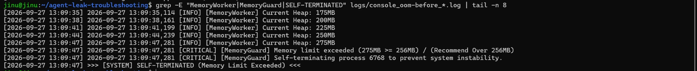
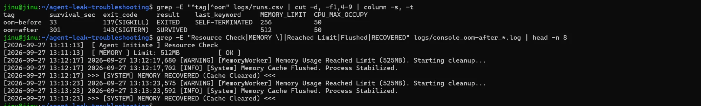
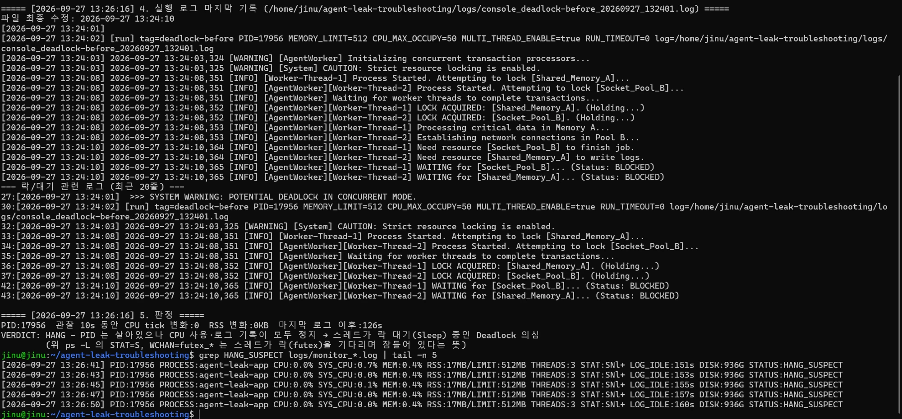
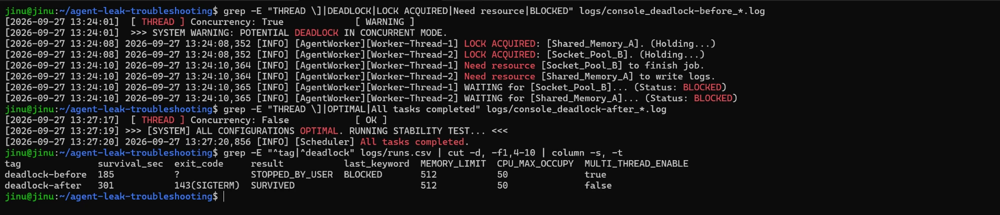
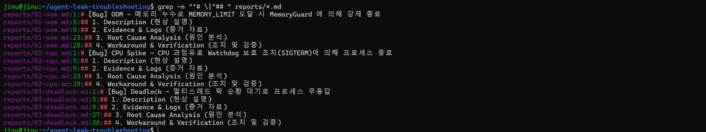

# 평가 항목 1 — 실행 증거

2026-09-27 WSL Ubuntu-22.04에서 제공 바이너리 `agent-leak-app`(x86)을 실행하고 수집한 증거입니다. 실행 방법과 명령은 [README 3-3 / 5장](../README.md#3-3-케이스별-실험)에 있습니다.

로그 한 줄은 `[수신 시각] 앱 원래 로그` 형태로, 앞의 시각은 `run_app.sh`가 붙이고 뒤의 시각(밀리초 포함)은 앱이 직접 남긴 것입니다.

| # | 평가 항목 | 캡처 |
|---|---|---|
| 1-1 | [OOM] 메모리 선형 증가 → 강제 종료 패턴 | 관제 로그, 실행 로그 |
| 1-2 | [OOM] `MEMORY_LIMIT` 조정 Before & After | runs.csv 비교, After 로그 |
| 1-3 | [CPU] CPU 사용률 임계치 초과 → 종료 패턴 | top, 실행 로그 |
| 1-4 | [CPU] `CPU_MAX_OCCUPY` 조정 Before & After | runs.csv 비교, After 로그 |
| 1-5 | [Deadlock] PID는 살아있으나 CPU/메모리/로그가 멈춘 상태 | ps -ef, diagnose_hang.sh, 관제 로그 |
| 1-6 | [Deadlock] `MULTI_THREAD_ENABLE` 조정 재현/회피 | Before/After 로그, runs.csv 비교 |
| 1-7 | [Format] 리포트 3건의 GitHub Issue 구조 | reports 섹션 목록 |
| 1-8 | [Evidence] PID·타임스탬프·핵심 메시지 포함 여부 | (설명) |

---

## 1-1. [OOM] 메모리 사용량이 선형으로 증가하다 강제 종료되는 패턴

**조건**: `MEMORY_LIMIT=256 CPU_MAX_OCCUPY=50 MULTI_THREAD_ENABLE=false` (tag `oom-before`)

### ① monitor.sh 관제 로그
```bash
grep -E "PID:|EXITED" logs/monitor_*.log | tail -n 18
```


- **선형 증가**: 실제 작업 프로세스(PID 6768)의 RSS가 2초 간격으로 대부분 25MB씩 일정하게 늘었습니다.
  - 42 → 67 → 92 → 117 → 142 → 167 → 192 → 217 → 242 → 267MB
  - 샘플 주기(2초)와 앱의 할당 주기(약 3초)가 달라서, 간혹 같은 값이 두 번 찍힌 구간이 있습니다(92, 167, 217MB).
- **메모리만의 문제**: 같은 기간 CPU는 0~2%, SYS_CPU는 1% 미만으로 거의 변하지 않았습니다.
- **경고 후 종료**: 13:09:38에 RSS가 한도의 80%를 넘자(217MB/256MB) `STATUS:MEM_WARN`으로 바뀌었습니다. 267MB를 기록한 직후인 13:09:47에 `PROCESS:agent-leak-app EXITED (PID:6768)`로 프로세스가 사라졌습니다.
- **첫 줄 PID가 다른 이유**: 첫 줄의 `PID:6760 RSS:2MB`는 PyInstaller 부트로더(부모)가 실제 작업 프로세스(6768)를 띄우기 직전에 잡힌 것입니다. 다음 샘플부터는 작업 프로세스를 추적합니다.

### ② 프로그램 실행 로그
```bash
grep -E "MemoryWorker|MemoryGuard|SELF-TERMINATED" logs/console_oom-before_*.log | tail -n 8
```


- **앱 쪽 기록**: `[MemoryWorker] Current Heap`이 약 3초마다 25MB씩(175 → 200 → 225 → 250 → 275MB) 늘어, 관제 로그의 RSS 증가와 같은 패턴을 보입니다.
- **종료 순서**: 13:09:47,281에 세 줄이 같은 밀리초에 연달아 기록되고 프로세스가 끝났습니다.
  1. `[CRITICAL] [MemoryGuard] Memory limit exceeded (275MB >= 256MB)`
  2. `Self-terminating process 6768 to prevent system instability.`
  3. `>>> [SYSTEM] SELF-TERMINATED (Memory Limit Exceeded) <<<`
- **결론**: 로그의 `process 6768`이 ①의 `PID:6768`과 같고, 종료 시각(13:09:47)도 일치합니다. **관제에서 사라진 그 프로세스가 MemoryGuard에 의해 스스로 종료된 것**임을 두 출처가 교차로 증명합니다.

---

## 1-2. [OOM] MEMORY_LIMIT 조정 후 생존 시간 증가 (Before & After)

**조건**: Before `MEMORY_LIMIT=256` / After `MEMORY_LIMIT=512` (나머지 동일, After는 `RUN_TIMEOUT=300`)

```bash
grep -E "^tag|^oom" logs/runs.csv | cut -d, -f1,4-9 | column -s, -t
grep -E "Resource Check|MEMORY \]|Reached Limit|Flushed|RECOVERED" logs/console_oom-after_*.log | head -n 8
```


| 구분 | MEMORY_LIMIT | 생존 시간 | 종료 코드 | 결과 |
|---|---|---|---|---|
| Before | 256MB | **33초** | 137 (SIGKILL) | `EXITED` / `SELF-TERMINATED` |
| After | 512MB | **301초 이상** | 143 (SIGTERM, 5분 제한 도달) | `SURVIVED` |

- **Before**: 33초 만에 MemoryGuard가 SIGKILL(137)로 종료했습니다.
- **After**: 시작 시 `[ MEMORY ] Limit: 512MB [ OK ]`로 판정됐습니다. 이후 메모리가 525MB에 도달해도 종료되지 않고 아래 흐름으로 회복했습니다.
  - `Memory Usage Reached Limit (525MB). Starting cleanup...` → `Memory Cache Flushed. Process Stabilized.` → `MEMORY RECOVERED (Cache Cleared)`
  - 이 회복이 13:12:17, 13:13:23에 약 66초 주기로 반복됐습니다.
- **After의 종료 코드 143**: 앱이 죽어서가 아니라, 5분 관찰 제한(`RUN_TIMEOUT=300`)에서 `run_app.sh`가 정상 종료시킨 것입니다(`result=SURVIVED`).
- **결론**: 한도를 올리니 생존 시간이 33초에서 5분 이상으로 **9배 이상 늘었습니다**.
- **한계**: 누수 자체(Heap 증가)는 그대로입니다. 이 조치는 임시 조치이며, 근본 해결은 코드에서 누적 데이터를 해제하는 것입니다.

---

## 1-3. [CPU] CPU 사용률이 임계치를 넘어 프로세스가 종료되는 패턴

**조건**: `CPU_MAX_OCCUPY=100 MEMORY_LIMIT=512 MULTI_THREAD_ENABLE=false` (tag `cpu-before`)

```bash
top -b -n 1 -p "$(pgrep -n -x agent-leak-app)" | head -n 8      # 실행 중 (13:17:38)
grep -E "CPU    \]|CpuWorker|WATCHDOG" logs/console_cpu-before_*.log | tail -n 12
```


- **부하 상승과 종료**: `[CpuWorker] Current Load`가 약 3초마다 올랐습니다.
  - 5.00% → 12.52 → 13.61 → 19.15 → 23.29 → 29.84 → 31.40 → 36.23 → 40.68 → 50.44% (13:17:24 → 13:17:52, 28초 동안)
  - 50%를 넘은 13:17:52,746에 `[CRITICAL] [CpuWorker] CPU Threshold Violated! (50.44%)`가 기록됐습니다.
  - 같은 초에 `>>> [SYSTEM] WATCHDOG: INITIATING EMERGENCY ABORT (SIGTERM) <<<`로 종료됐습니다.
- **오류가 아니라 보호 조치**: Traceback이나 Exception 없이 Watchdog의 긴급 중단 선언 직후 SIGTERM(143)으로 끝났습니다. 과점유 방지 정책에 따른 의도된 종료입니다.
- **top 스냅샷(13:17:38) 해석**:
  - `PID 12401`은 `-p` 옵션으로 대상 프로세스 한 개만 걸러 본 것입니다.
  - `NI 10`은 앱의 SafetyGuard가 우선순위를 낮춘 흔적(`nice=10`)입니다.
  - 헤더 `%Cpu(s) ... 95.1 id`는 시스템 전체가 한가하다는 뜻입니다. 따라서 **시스템 전체 부하가 아니라 특정 프로세스의 문제**로 범위를 좁힐 수 있습니다.
- **Load와 top 수치 차이**: 같은 시각 앱이 보고한 Load는 23~29%였지만, top의 실측 %CPU는 0.0이었습니다. `Current Load`는 앱이 과점유 상황을 흉내 내 **내부적으로 계산한 값**이며, 실제 코어 점유율과는 다릅니다. 리포트에는 두 값을 함께 제시하고 이 차이를 명시합니다.

---

## 1-4. [CPU] CPU_MAX_OCCUPY 조정 후 종료 여부 변화 (Before & After)

**조건**: Before `CPU_MAX_OCCUPY=100` / After `CPU_MAX_OCCUPY=50` (나머지 동일, After는 `RUN_TIMEOUT=300`)

```bash
grep -E "^tag|^cpu" logs/runs.csv | cut -d, -f1,4-9 | column -s, -t
grep -E "CPU    \]|Peak reached|Cooldown complete" logs/console_cpu-after_*.log | head -n 6
```


| 구분 | CPU_MAX_OCCUPY | 생존 시간 | 종료 코드 | 결과 |
|---|---|---|---|---|
| Before | 100% | **30초** | 143 (SIGTERM, Watchdog) | `EXITED` / `WATCHDOG` |
| After | 50% | **301초 이상** | 143 (SIGTERM, 5분 제한 도달) | `SURVIVED` |

- **종료 코드는 같지만 의미가 다름**: 두 실행 모두 143입니다. Before는 Watchdog가 보낸 SIGTERM(`last_keyword=WATCHDOG`)이고, After는 관찰 제한 도달로 `run_app.sh`가 보낸 SIGTERM(`SURVIVED`)입니다. `result`와 `last_keyword`로 구분합니다.
- **After 동작**: 시작 시 `[ CPU ] Limit: 50% [ OK ]`로 판정됐습니다. 부하가 한도에 닿으면 `Violated` 대신 아래를 반복하며, 임계치를 스스로 넘지 않았습니다.
  - `Peak reached (50.00%). Starting cooldown...`(13:18:47, 13:20:05, 13:21:20)
  - `Cooldown complete (5.00%). Resuming load increase...`(13:19:24, 13:20:36)
- **결론**: 허용 상한을 Watchdog 한계(50%) 이하로 낮추니, 과점유 없이 **부하를 스스로 조절하며 5분 이상 생존**했습니다.

---

## 1-5. [Deadlock] 프로세스는 살아있으나 CPU/메모리/로그가 멈춘 상태 식별

**조건**: `MULTI_THREAD_ENABLE=true MEMORY_LIMIT=512 CPU_MAX_OCCUPY=50` (tag `deadlock-before`). 로그가 멈춘 뒤 약 2분이 지난 시점에 진단했습니다.

```bash
ps -ef | grep [a]gent-leak-app
bash scripts/diagnose_hang.sh 10
grep HANG_SUSPECT logs/monitor_*.log | tail -n 5
```



**① PID 존재 (`ps -ef`)**
- 프로세스 트리 `script(17953) → 부트로더(17955) → 실제 작업 프로세스(17956)`가 모두 살아 있습니다. 즉 **크래시가 아닙니다**.

**② CPU·메모리 변화 없음 (`ps -L` T0 13:26:05 → T1 13:26:15, `top -H`)**
- **스레드 상태**: 작업 프로세스의 스레드 3개(LWP 17956, 18082, 18083)가 T0와 T1 모두 같은 상태입니다.
  - `STAT=SNl+`: S는 대기(sleep), N은 nice, l은 멀티스레드
  - `WCHAN=futex_wait_queue`
  - `%CPU 0.0`, `TIME 00:00:00`
- **10초 동안의 변화**:
  - `cpu_ticks=6` → `6` (변화 0)
  - `rss=17792KB` → `17792KB` (변화 0)
- **top -H**: `Threads: 3 total, 0 running, 3 sleeping`, 각 스레드 %CPU 0.0, 시스템 `100.0 id`

**③ 로그 기록 정지 (마지막 로그)**
- 로그 파일의 최종 수정 시각은 13:24:10이고, 진단 시점(13:26:16)까지 126초 동안 새 기록이 없습니다.
- 마지막 두 줄(13:24:10,365)은 아래와 같습니다.
  - `[Worker-Thread-1] WAITING for [Socket_Pool_B]... (Status: BLOCKED)`
  - `[Worker-Thread-2] WAITING for [Shared_Memory_A]... (Status: BLOCKED)`

**④ 판정과 관제 로그**
- `diagnose_hang.sh`의 결과는 아래와 같습니다.
  - `PID:17956 관찰 10s 동안 CPU tick 변화:0 RSS 변화:0KB 마지막 로그 이후:126s`
  - `VERDICT: HANG`
- `monitor.sh`도 13:26:41~13:26:50 동안 같은 상태를 계속 기록했습니다.
  - `CPU:0.0%`, `RSS:17MB` 고정, `THREADS:3`
  - `LOG_IDLE`가 151s → 160s로 계속 증가
  - `STATUS:HANG_SUSPECT`

**⑤ 스레드/락 대기 추론 근거**
- `futex_wait_queue`는 스레드가 **커널 futex(락)를 얻기 위해 잠들어 기다리는 중**이라는 뜻입니다.
- 모든 스레드가 이 상태이고 CPU를 쓰지 않으므로, 무한 루프(CPU 100%)나 I/O 대기(`D` 상태)가 아니라 **락 대기로 인한 정지**입니다.
- 마지막 로그의 `WAITING ... BLOCKED` 두 줄이 서로 상대 자원을 기다리고 있어, 교착상태로 결론짓습니다(순환 관계는 1-6에서 설명).

> **검토 결과**: 과제의 Deadlock 필수 증거 4가지가 모두 두 장의 캡처에 포함되어 있습니다.
> - PID 존재(`ps -ef`)
> - CPU/MEM 정체(`ps -L` T0/T1, `top -H`)
> - 마지막 로그(`WAITING… BLOCKED`)
> - 스레드/락 대기 근거(`futex_wait_queue`, 변화량 0)
>
> 또한 세 출처(diagnose, 관제, 앱 로그)의 PID(17956)와 시간 흐름(13:24:10 정지 → 13:26:16 로그 정지 126초 → 13:26:50 LOG_IDLE 160초)이 서로 일치합니다.

---

## 1-6. [Deadlock] MULTI_THREAD_ENABLE 조정 후 데드락 재현/회피 비교

**조건**: Before `MULTI_THREAD_ENABLE=true` / After `MULTI_THREAD_ENABLE=false` (나머지 동일, After는 `RUN_TIMEOUT=300`)

```bash
grep -E "THREAD \]|DEADLOCK|LOCK ACQUIRED|Need resource|BLOCKED" logs/console_deadlock-before_*.log
grep -E "THREAD \]|OPTIMAL|All tasks completed" logs/console_deadlock-after_*.log
grep -E "^tag|^deadlock" logs/runs.csv | cut -d, -f1,4-10 | column -s, -t
```


**Before (재현)**: 앱은 시작할 때부터 `[ THREAD ] Concurrency: True [ WARNING ]`, `POTENTIAL DEADLOCK IN CONCURRENT MODE`로 위험을 경고했습니다. 이후 로그에 순환 대기가 그대로 드러납니다.

| 시각 | Worker-Thread-1 | Worker-Thread-2 |
|---|---|---|
| 13:24:08,352 | `LOCK ACQUIRED: [Shared_Memory_A]` (보유) | `LOCK ACQUIRED: [Socket_Pool_B]` (보유) |
| 13:24:10,364 | `Need resource [Socket_Pool_B]` | `Need resource [Shared_Memory_A]` |
| 13:24:10,365 | `WAITING for [Socket_Pool_B]... BLOCKED` | `WAITING for [Shared_Memory_A]... BLOCKED` |

- **순환 대기**: Thread-1은 A를 쥔 채 B를, Thread-2는 B를 쥔 채 A를 기다립니다(1 → 2 → 1).
- **교착의 4가지 조건**이 모두 성립합니다. 이후 어떤 스레드도 락을 놓지 않아 로그가 영원히 멈췄습니다.
  - 상호 배제: 락은 한 스레드만 보유
  - 점유 대기: 쥔 채로 추가 요청
  - 비선점: 강제로 뺏을 수 없음
  - 순환 대기: 1 → 2 → 1

**After (회피)**: `[ THREAD ] Concurrency: False [ OK ]` → `ALL CONFIGURATIONS OPTIMAL. RUNNING STABILITY TEST...` → `[Scheduler] All tasks completed.` 순서로 진행됐습니다. 락 경쟁 없이 작업이 끝났고, 이후 5분 동안 정상 동작했습니다.

| 구분 | MULTI_THREAD_ENABLE | 생존 | 결과 | last_keyword |
|---|---|---|---|---|
| Before | true | 185초 (정지 상태로 유지하다 수동 종료) | `STOPPED_BY_USER` | `BLOCKED` |
| After | false | 301초 이상 | `SURVIVED` | — |

- **Before의 `exit_code`가 `?`인 이유**: 이 실행 당시 `run_app.sh`에는 Ctrl+C로 중단하면 종료 코드를 기록하기 전에 출력 파이프라인이 먼저 끊기는 버그가 있었습니다. 이후 수정했고, 지금은 같은 절차에서 `143(SIGTERM)`이 기록됩니다. Before 판정의 근거는 종료 코드가 아니라 아래 두 가지이므로, 비교 결과에는 영향이 없습니다.
  - `STOPPED_BY_USER`: 스스로 끝나지 못해 사람이 종료함
  - `last_keyword=BLOCKED`: 마지막 기록이 락 대기

> **검토 결과**: 재현(Before)과 회피(After)가 한 장에 모두 담겨 있습니다.
> - Before: 경고 배너 → 락 교차 획득 → 상호 대기 → BLOCKED
> - After: `Concurrency: False` → OPTIMAL → 작업 완료
> - runs.csv 비교(수동 종료 대 SURVIVED)
>
> 변수 하나만 바꿔 결과가 뒤집혔으므로 인과관계도 성립합니다.

---

## 1-7. [Format] 리포트 3건의 GitHub Issue 구조

```bash
grep -n "^# \|^## " reports/*.md
```


- **3건 모두 같은 구조**: [01-oom.md](../reports/01-oom.md), [02-cpu.md](../reports/02-cpu.md), [03-deadlock.md](../reports/03-deadlock.md)는 제목 `[Bug] {장애 유형} - {한 줄 요약}` 아래에 같은 4단 구조를 갖췄습니다.
  - `## 1. Description (현상 설명)`
  - `## 2. Evidence & Logs (증거 자료)`
  - `## 3. Root Cause Analysis (원인 분석)`
  - `## 4. Workaround & Verification (조치 및 검증)`
- **흐름**: 현상 → 증거 → 원인 → 조치 순서로 GitHub Issue 템플릿을 따릅니다.
- **증거 연결**: 각 리포트의 증거 칸은 이 문서 1-1~1-6의 캡처·발췌로 채워, 리포트만 읽어도 재현 경로와 근거를 확인할 수 있게 합니다.

---

## 1-8. [Evidence] PID · 로그 타임스탬프 · 핵심 로그 메시지 포함 여부

위 캡처들은 모두 증거의 세 요소를 함께 담고 있습니다. 특히 **서로 다른 도구에서 같은 PID와 같은 시각이 반복해서 나타나도록** 구성해, 한 출처만 보고 내린 판단이 아니라는 점을 보였습니다.

- **PID**: 관제 도구와 앱 로그가 같은 프로세스를 가리킵니다.
  - OOM: monitor의 `PID:6768`과 앱 로그의 `Self-terminating process 6768`이 일치합니다. 관제가 추적한 바로 그 프로세스가 MemoryGuard에 의해 종료됐음이 확인됩니다.
  - Deadlock: `ps -ef`, `diagnose_hang.sh`, `monitor.sh`, `run_app.sh`의 `[run] ... PID=17956`이 모두 같은 PID 17956을 가리킵니다.
  - `ps -ef`로 부모–자식 관계(script → 부트로더 → 작업 프로세스)도 함께 보였습니다.
  - Before/After 실행마다 `runs.csv`의 `pid` 열로 어떤 실행인지 식별할 수 있습니다.
- **타임스탬프**: 모든 로그 줄에 두 개의 시각이 있습니다.
  - `[수신 시각]`: `run_app.sh`가 붙인 초 단위 시각
  - 앱 자체 시각: 밀리초 단위
  - 이를 이용해 사건의 순서를 초·밀리초 단위로 재구성했습니다. 예를 들어 OOM은 13:09:47,281의 한 밀리초 안에 한도 초과 → 자기 종료 선언 → 배너가 연달아 기록됐고, 관제는 같은 초에 `EXITED`를 기록했습니다. Deadlock은 13:24:10,365에 로그가 멈춘 뒤, 13:26:16 진단에서 126초, 13:26:50 관제에서 160초의 정지 시간이 이어졌습니다.
  - `runs.csv`의 `start`/`end`로 생존 시간을 계산해 Before/After를 수치로 비교했습니다.
- **핵심 로그 메시지**: 장애마다 종료·정지를 직접 증명하는 문구를 발췌했습니다.

| 장애 | 핵심 메시지 |
|---|---|
| OOM | `[MemoryGuard] Memory limit exceeded (275MB >= 256MB)`, `Self-terminating process <PID>`, `>>> [SYSTEM] SELF-TERMINATED (Memory Limit Exceeded) <<<` |
| CPU | `[CpuWorker] CPU Threshold Violated! (50.44%)`, `>>> [SYSTEM] WATCHDOG: INITIATING EMERGENCY ABORT (SIGTERM) <<<` |
| Deadlock | `LOCK ACQUIRED ... (Holding...)`, `WAITING for [...]... (Status: BLOCKED)`, 진단 결과 `VERDICT: HANG` |
| After (조치 효과) | `MEMORY RECOVERED (Cache Cleared)`, `Peak reached (50.00%). Starting cooldown...`, `ALL CONFIGURATIONS OPTIMAL` |

- **캡처와 텍스트를 함께 제시**: 각 캡처 위에 그 화면을 만든 명령을 적어 두었습니다. 원본 로그(`logs/console_*.log`, `logs/monitor_*.log`, `logs/diagnose_*.log`, `logs/runs.csv`)에서 같은 명령으로 언제든 다시 추출해 검증할 수 있습니다.
