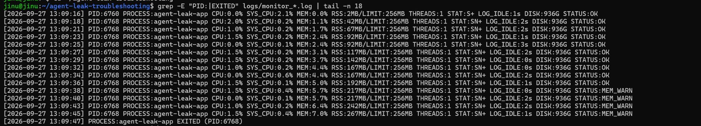
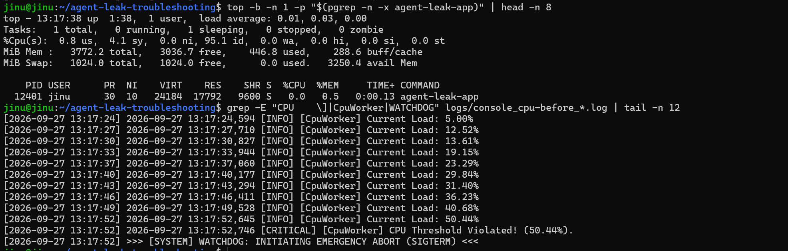
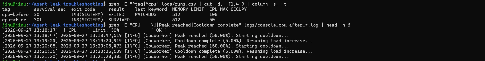
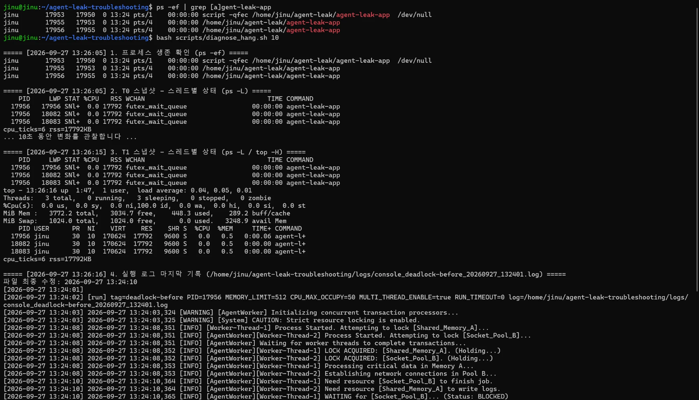

# WSL2 Ubuntu 실행 증빙 — 평가항목 1 (항목 1~8)

이 문서는 WSL2 Ubuntu 22.04 환경에서 제공 바이너리 `agent-leak-app`(x86)을 실제로 실행해 얻은 결과를 항목별로 정리한 것입니다(2026-09-27). 각 캡처 아래에 무엇을 확인했는지와 결과가 무슨 뜻인지를 쉽게 설명했습니다. 원본 로그는 [`logs/`](../logs)에 그대로 올려 두었습니다.

## 한눈에 보기

| 항목 | 확인 대상 | 결과 |
|---|---|---|
| 1 | [OOM] 메모리 선형 증가 후 강제 종료 패턴 | 확인 (33초 후 MemoryGuard 종료) |
| 2 | [OOM] `MEMORY_LIMIT` 256 → 512 Before & After | 확인 (33초 → 301초 이상 생존) |
| 3 | [CPU] CPU 사용률 임계치 초과 후 종료 패턴 | 확인 (50.44%에서 Watchdog SIGTERM) |
| 4 | [CPU] `CPU_MAX_OCCUPY` 100 → 50 Before & After | 확인 (30초 → 301초 이상 생존) |
| 5 | [Deadlock] PID는 살아있으나 CPU·메모리·로그가 멈춘 상태 | 확인 (`VERDICT: HANG`) |
| 6 | [Deadlock] `MULTI_THREAD_ENABLE` true → false 재현/회피 | 확인 (BLOCKED → 정상 동작) |
| 7 | [Format] 리포트 3건의 GitHub Issue 구조 | 확인 (3건 × 4개 섹션) |
| 8 | [Evidence] PID·타임스탬프·핵심 로그 메시지 포함 | 확인 |

> 로그 한 줄은 `[수신 시각] 앱 원래 로그` 형태입니다. 앞의 시각은 `run_app.sh`가 붙인 것이고, 뒤의 시각(밀리초 포함)은 앱이 직접 남긴 것입니다.

## 1. [OOM] 메모리 사용량 선형 증가 → 강제 종료

### 실행한 확인

- `MEMORY_LIMIT=256`으로 앱을 실행했습니다. CPU와 스레드 설정은 다른 장애가 끼어들지 않도록 안정값(`CPU_MAX_OCCUPY=50`, `MULTI_THREAD_ENABLE=false`)으로 고정했습니다.
- 종료된 뒤 `grep`으로 `monitor.sh` 관제 로그의 PID·RSS 변화와 실행 로그의 `MemoryWorker`·`MemoryGuard` 부분을 뽑았습니다.

### 결과 설명

- **관제 로그 (위 캡처)**
  - 실제 작업 프로세스 PID 6768의 RSS(실제 사용 중인 물리 메모리)가 42 → 67 → 92 → … → 267MB로 매번 약 25MB씩 일정하게 늘었습니다. **선형 증가** 패턴입니다.
  - 같은 기간 CPU는 0~2%로 거의 변하지 않았으므로, 연산 문제가 아니라 **메모리만의 문제**입니다.
  - 한도의 80%를 넘은 13:09:38부터 `STATUS:MEM_WARN`이 찍혔고, 13:09:47에 `EXITED (PID:6768)`로 프로세스가 사라졌습니다.
  - 첫 줄의 `PID:6760 RSS:2MB`는 PyInstaller 부트로더(부모)가 실제 작업 프로세스를 띄우기 직전에 잡힌 것입니다.
- **실행 로그 (아래 캡처)**
  - 앱 스스로도 `Current Heap`이 약 3초마다 25MB씩 늘어난다고 기록했습니다.
  - 275MB가 된 13:09:47,281에 같은 밀리초 안에 세 줄이 연달아 남고 종료됐습니다.
    - `Memory limit exceeded (275MB >= 256MB)`
    - `Self-terminating process 6768`
    - `>>> [SYSTEM] SELF-TERMINATED (Memory Limit Exceeded) <<<`
- **결론**: 로그의 `process 6768`과 관제의 `PID:6768`이 같고 종료 시각도 같습니다. 따라서 관제에서 사라진 프로세스가 **앱의 메모리 보호 정책(MemoryGuard)에 의해 스스로 종료된 것**이 두 출처로 확인됩니다.

## 2. [OOM] MEMORY_LIMIT 조정 Before & After

### 실행한 확인

- `MEMORY_LIMIT`만 512로 올려 다시 실행하고, 5분(`RUN_TIMEOUT=300`) 동안 살아 있는지 관찰했습니다.
- `runs.csv`에서 두 실행을 나란히 비교하고, After 실행 로그에서 한도 도달 시의 동작을 확인했습니다.

### 결과 설명

| 구분 | MEMORY_LIMIT | 생존 시간 | 종료 코드 | 결과 |
|---|---|---|---|---|
| Before | 256MB | 33초 | 137 (SIGKILL) | `EXITED` / `SELF-TERMINATED` |
| After | 512MB | 301초 이상 | 143 (SIGTERM) | `SURVIVED` |

- **Before**: 33초 만에 종료 코드 137(= 128 + SIGKILL 9)로 강제 종료됐습니다.
- **After**: 시작할 때 `[ MEMORY ] Limit: 512MB [ OK ]`로 판정됐습니다. 525MB에 도달해도 종료 대신 `Starting cleanup...` → `Memory Cache Flushed` → `MEMORY RECOVERED`로 캐시를 비우고 계속 실행됐습니다(5분 동안 4회).
- **After의 143**: 앱이 죽은 것이 아니라 5분 관찰이 끝나서 `run_app.sh`가 정상 종료시킨 것입니다(`SURVIVED`).
- **결론**: 생존 시간이 **33초에서 5분 이상으로 9배 넘게** 늘었습니다. 다만 메모리가 계속 늘어나는 누수 자체는 그대로이므로 임시 조치입니다.

## 3. [CPU] CPU 사용률 임계치 초과 → 종료

### 실행한 확인

- `CPU_MAX_OCCUPY=100`으로 앱을 실행했습니다(메모리 512, 스레드 false로 고정).
- 실행 중(13:17:38)에 `top -b -n 1 -p <PID>`로 해당 프로세스와 시스템 전체의 CPU를 찍었습니다.
- 종료된 뒤 실행 로그의 `CpuWorker`·`WATCHDOG` 부분을 뽑았습니다.

### 결과 설명

- **실행 로그 (아래쪽)**
  - `Current Load`가 약 3초마다 5.00% → 12.52 → 19.15 → 29.84 → 40.68 → 50.44%로 계속 올랐습니다.
  - 50%를 넘은 13:17:52,746에 `CPU Threshold Violated! (50.44%)`가 기록됐습니다.
  - 곧바로 `>>> [SYSTEM] WATCHDOG: INITIATING EMERGENCY ABORT (SIGTERM) <<<`와 함께 종료됐습니다(종료 코드 143 = 128 + SIGTERM 15).
  - 오류 메시지(Traceback)는 없습니다. 따라서 프로그램이 고장 난 것이 아니라 **과점유 방지 정책(Watchdog)이 시스템 보호를 위해 끊은 것**입니다.
- **top (위쪽)**
  - `-p` 옵션으로 대상 프로세스 PID 12401 한 개만 걸러 봤습니다.
  - 헤더의 `%Cpu(s) ... 95.1 id`는 시스템 전체가 95% 쉬고 있다는 뜻입니다. 따라서 **시스템 전체 부하가 아니라 이 프로세스 하나의 문제**로 범위를 좁힐 수 있습니다.
  - `NI 10`은 앱이 시작할 때 스스로 우선순위를 낮춘 흔적입니다(SafetyGuard).
- **Load와 top 수치 차이**: 같은 시각 앱이 보고한 Load는 23~29%였지만, top의 실제 %CPU는 0.0이었습니다. `Current Load`는 앱이 과점유 상황을 흉내 내 **내부적으로 계산한 값**이라 실제 코어 사용률과 다릅니다. 그래서 두 값을 함께 제시했습니다.

## 4. [CPU] CPU_MAX_OCCUPY 조정 Before & After

### 실행한 확인

- `CPU_MAX_OCCUPY`만 50으로 낮춰 다시 실행하고 5분 동안 관찰했습니다.
- `runs.csv` 비교와 After 실행 로그의 `Peak reached`·`Cooldown complete` 부분을 확인했습니다.

### 결과 설명

| 구분 | CPU_MAX_OCCUPY | 생존 시간 | 종료 코드 | 결과 |
|---|---|---|---|---|
| Before | 100% | 30초 | 143 (SIGTERM) | `EXITED` / `WATCHDOG` |
| After | 50% | 301초 이상 | 143 (SIGTERM) | `SURVIVED` |

- **종료 코드는 같지만 이유가 다릅니다.** 두 실행 모두 143입니다. Before는 Watchdog가 보낸 종료(`last_keyword=WATCHDOG`)이고, After는 5분 관찰이 끝나 `run_app.sh`가 보낸 종료(`SURVIVED`)입니다. 그래서 `result`와 `last_keyword` 열로 구분합니다.
- **After**
  - 시작할 때 `[ CPU ] Limit: 50% [ OK ]`로 판정됐습니다.
  - 부하가 50%에 닿으면 `Peak reached (50.00%). Starting cooldown...`으로 스스로 내렸다가, 5%까지 떨어지면 `Cooldown complete`로 다시 올리기를 반복했습니다(13:18:47, 13:20:05, 13:21:20).
  - 임계치 위반은 한 번도 없었습니다.
- **결론**: 허용 상한을 Watchdog 한계(50%) 이하로 낮추니, 앱이 부하를 스스로 조절하며 **종료 없이 5분 이상** 동작했습니다.

## 5. [Deadlock] 살아있지만 멈춘 상태 식별

### 실행한 확인

- `MULTI_THREAD_ENABLE=true`로 앱을 실행하고(메모리 512, CPU 50으로 고정), 로그가 멈춘 뒤 약 2분이 지나 다른 터미널에서 진단했습니다.
- `ps -ef`로 프로세스가 살아 있는지 확인했습니다.
- `diagnose_hang.sh 10`으로 아래를 순서대로 확인했습니다.
  1. 스레드 상태를 10초 간격으로 두 번(T0, T1) 찍어 비교
  2. `top -H`로 스레드별 CPU 확인
  3. 마지막 로그 확인
  4. 최종 판정
- `monitor.sh` 로그에서 `HANG_SUSPECT` 줄을 확인했습니다.

### 결과 설명

- **살아 있음**: `ps -ef`에 `script(17953) → 부트로더(17955) → 작업 프로세스(17956)`가 모두 있습니다. 프로세스가 죽은 것(크래시)이 아닙니다.
- **아무 일도 안 함**
  - 작업 프로세스의 스레드 3개가 T0(13:26:05)와 T1(13:26:15)에서 완전히 같습니다. 모두 `STAT=SNl+`(S = 잠든 상태), `%CPU 0.0`, `TIME 00:00:00`입니다.
  - 10초 동안 CPU 사용 누적값(`cpu_ticks=6`)과 메모리(`rss=17792KB`)가 전혀 변하지 않았습니다.
  - `top -H`도 `0 running, 3 sleeping`, 시스템 `100.0 id`였습니다.
- **로그 멈춤**: 로그 파일은 13:24:10 이후 수정되지 않았습니다. 마지막 두 줄은 두 스레드가 각각 `WAITING for [...]... (Status: BLOCKED)` 상태라는 기록입니다.
- **판정**: `CPU tick 변화:0  RSS 변화:0KB  마지막 로그 이후:126s` → `VERDICT: HANG`. `monitor.sh`도 같은 기간 `CPU:0.0%`, `RSS:17MB` 고정, `LOG_IDLE` 151 → 160초 증가, `STATUS:HANG_SUSPECT`를 기록했습니다.
- **락 대기로 보는 근거**
  - 모든 스레드의 `WCHAN`이 `futex_wait_queue`입니다. 이는 스레드가 **락(futex)을 얻으려고 잠들어 기다리는 중**이라는 뜻입니다.
  - 무한 루프라면 CPU를 계속 썼을 것이고, 디스크 대기라면 상태가 `D`였을 것입니다. 둘 다 아니므로 **락 대기로 멈춘 교착상태**로 판단했습니다.

## 6. [Deadlock] MULTI_THREAD_ENABLE 조정 재현/회피 비교

### 실행한 확인

- 5번 진단 후 Before 실행을 `Ctrl+C`로 멈추고, `MULTI_THREAD_ENABLE=false`로 바꿔 5분 동안 다시 실행했습니다.
- Before 로그의 락 획득·대기 기록, After 로그의 정상 진행 기록, `runs.csv` 비교를 확인했습니다.

### 결과 설명

**Before (true, 재현)**: 시작할 때부터 `[ THREAD ] Concurrency: True [ WARNING ]`, `POTENTIAL DEADLOCK IN CONCURRENT MODE`로 경고했고, 이후 로그에 서로 물고 물리는 대기가 그대로 드러납니다.

| 시각 | Worker-Thread-1 | Worker-Thread-2 |
|---|---|---|
| 13:24:08,352 | `Shared_Memory_A` 잠금 획득 | `Socket_Pool_B` 잠금 획득 |
| 13:24:10,364 | `Socket_Pool_B`가 필요함 | `Shared_Memory_A`가 필요함 |
| 13:24:10,365 | `Socket_Pool_B` 대기 → `BLOCKED` | `Shared_Memory_A` 대기 → `BLOCKED` |

- **순환 대기**: Thread-1은 A를 쥔 채 B를, Thread-2는 B를 쥔 채 A를 기다립니다. 서로 상대가 놓아 주기만 기다리므로 영원히 진행하지 못합니다.
- **교착상태 4대 조건**이 모두 성립했습니다.
  - 상호 배제: 락은 한 스레드만 가짐
  - 점유 대기: 쥔 채로 또 요청
  - 비선점: 강제로 뺏을 수 없음
  - 순환 대기: 1 → 2 → 1

**After (false, 회피)**: `[ THREAD ] Concurrency: False [ OK ]` → `ALL CONFIGURATIONS OPTIMAL` → `[Scheduler] All tasks completed.`로 작업이 모두 끝났고, 이후 5분 동안 로그가 끊기지 않았습니다.

| 구분 | MULTI_THREAD_ENABLE | 경과 | 결과 | 마지막 키워드 |
|---|---|---|---|---|
| Before | true | 9초 만에 정지 → 185초에 수동 종료 | `STOPPED_BY_USER` | `BLOCKED` |
| After | false | 301초 이상 정상 동작 | `SURVIVED` | — |

- **Before의 `exit_code`가 `?`인 이유**
  - 이 실행 당시 `run_app.sh`에는 `Ctrl+C`로 멈추면 종료 코드를 적기 전에 출력이 끊기는 버그가 있었습니다. 지금은 수정되어 `143(SIGTERM)`이 기록됩니다.
  - 데드락 상태의 앱은 스스로 끝나지 않으므로, 종료 코드는 "사람이 SIGTERM을 보냈다"는 것 외에 의미가 없습니다. 판정 근거는 `STOPPED_BY_USER`(스스로 끝나지 못함)와 `BLOCKED`(마지막 기록이 락 대기)입니다.
- **결론**: 변수 하나(`MULTI_THREAD_ENABLE`)만 바꿨는데 결과가 "정지"에서 "정상 동작"으로 뒤집혔습니다. 따라서 멀티스레드 락 경쟁이 원인임이 확인됩니다.

## 7. [Format] 리포트 3건의 GitHub Issue 구조

### 실행한 확인

`grep -n "^# \|^## " reports/*.md`로 세 리포트의 제목과 섹션 목록을 뽑았습니다.

### 결과 설명

[01-oom.md](../reports/01-oom.md), [02-cpu.md](../reports/02-cpu.md), [03-deadlock.md](../reports/03-deadlock.md) 모두 제목이 `[Bug] {장애 유형} - {한 줄 요약}` 형식입니다. 아래에 같은 4개 섹션이 순서대로 있습니다.

1. `Description (현상 설명)`: 언제, 어떤 조건에서, 무엇이 일어났는지
2. `Evidence & Logs (증거 자료)`: 관제 로그, 실행 로그, `ps`/`top` 출력
3. `Root Cause Analysis (원인 분석)`: 증거를 근거로 한 원인과 OS 동작 원리
4. `Workaround & Verification (조치 및 검증)`: 환경변수 조정과 Before & After 결과

즉 현상 → 증거 → 원인 → 조치 순서의 GitHub Issue 구조를 세 건 모두 갖췄습니다. 각 리포트의 증거는 이 문서의 1~6번 결과(실제 PID, 시각, 수치)로 채웠습니다.

## 8. [Evidence] PID · 타임스탬프 · 핵심 로그 메시지 포함 여부

### 확인 방법

별도 실행 없이, 1~6번 캡처에 증거의 세 요소(PID, 시각, 핵심 메시지)가 모두 들어 있는지 점검했습니다.

### 결과 설명

- **PID**: 서로 다른 도구가 같은 프로세스를 가리키도록 캡처했습니다.
  - OOM: 관제 로그의 `PID:6768`과 앱 로그의 `Self-terminating process 6768`이 같습니다. 관제가 지켜보던 바로 그 프로세스가 MemoryGuard에 의해 종료됐다는 뜻입니다.
  - Deadlock: `ps -ef`, `diagnose_hang.sh`, `monitor.sh`, `run_app.sh` 모두 PID `17956`을 가리킵니다.
  - Before & After 비교에서는 `runs.csv`의 `pid` 열로 각 실행을 구분합니다.
- **타임스탬프**: 모든 로그 줄에 초 단위 수신 시각과 앱 자체의 밀리초 시각이 함께 있어, 사건 순서를 정확히 재구성할 수 있습니다.
  - OOM: 13:09:47,281 한 밀리초 안에 한도 초과 → 자기 종료 선언 → 종료 배너가 이어졌고, 관제도 같은 초에 `EXITED`를 기록했습니다.
  - Deadlock: 13:24:10,365에 로그가 멈춘 뒤, 13:26:16 진단에서 126초, 13:26:50 관제에서 160초의 정지 시간이 이어졌습니다.
- **핵심 로그 메시지**

| 장애 | 핵심 메시지 |
|---|---|
| OOM | `Memory limit exceeded (275MB >= 256MB)`, `Self-terminating process 6768`, `SELF-TERMINATED (Memory Limit Exceeded)` |
| CPU | `CPU Threshold Violated! (50.44%)`, `WATCHDOG: INITIATING EMERGENCY ABORT (SIGTERM)` |
| Deadlock | `LOCK ACQUIRED ... (Holding...)`, `WAITING for [...]... (Status: BLOCKED)`, `VERDICT: HANG` |
| 조치 효과 | `MEMORY RECOVERED (Cache Cleared)`, `Peak reached (50.00%). Starting cooldown...`, `ALL CONFIGURATIONS OPTIMAL` |

- **다시 검증하는 방법**: 캡처마다 그 화면을 만든 명령을 "실행한 확인"과 [README 5장](../README.md#5-평가항목-1--수행-내역과-검증-명령)에 적어 두었습니다. [`logs/`](../logs)의 원본 로그에서 같은 명령으로 언제든 같은 결과를 다시 뽑을 수 있습니다.

## 최종 확인

평가항목 1의 8개 항목 실행 증빙을 모두 확인했습니다. 세 가지 장애(OOM, CPU Spike, Deadlock)를 각각 재현하고, 관제 데이터와 실행 로그로 원인을 확인했습니다. 환경변수 하나만 바꿨을 때 결과가 뒤집히는 Before & After도 확인했습니다.

- OOM: 33초 → 5분 이상
- CPU: 30초 → 5분 이상
- Deadlock: 정지 → 정상 동작

이 결과를 GitHub Issue 형식 리포트 3건으로 정리했습니다.
